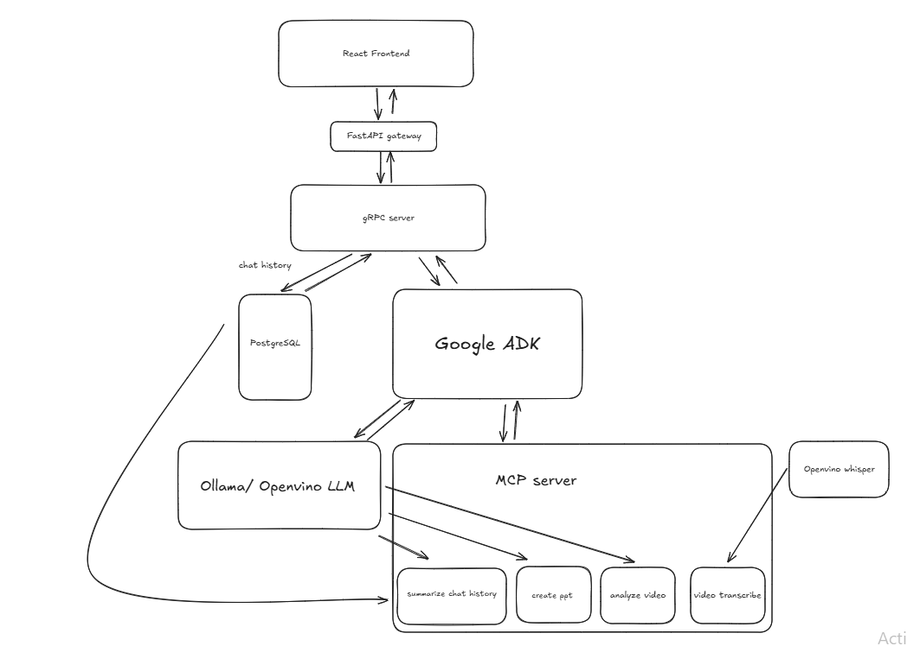

# GenAI Desktop Application

A **fully local AI desktop application** capable of analyzing and querying **short video files**. The application can **extract and summarize content**, **generate reports (PDF/PPT)**, and  **operate entirely offline** using **local AI models** and **MCP servers**.

## Models used:

LLM agents: qwen3:8b

VLM: minicpm-v

Transcription: Openvino Whisper

---

## Architecture



---

## Project Summary

### What Works
1. **Frontend**
   - Successfully supports video upload and normal chat interactions.  
   - Chat history is stored persistently across sessions.

2. **Backend**
   - Implemented a gRPC server with a FastAPI gateway to handle chat requests.  
   - Chat messages are stored in a PostgreSQL database and uploaded videos are stored backend.

3. **AI Integration**
   - Integrated Google ADK with MCP tools to perform multiple AI tasks locally:
     - Summarize chat history and export it as a PDF.  
     - Analyze uploaded videos.  
     - Transcribe video content using Whisper.  
     - Generate PowerPoint slides from video transcript.
    
4. **C# Launcher**
   - Able to run the whole application using C# Launcher

---

### What Doesn’t Work / Current Limitations
1. **Model Performance**
   - OpenVINO LLMs cannot run effectively due to insufficient computational power on Comet Lake hardware.  
   - Only models below 2B parameters can run, which tend to hallucinate and produce unreliable outputs.

2. **Presentation Generation**
   - PowerPoint slide creation is inconsistent — some slides have missing or incorrect titles and content.

---

### Encountered Challenges
1. **Hardware Constraints**
   - OpenVINO LLM inference requires higher computational resources than available on Comet Lake.  
   - Attempts to use Intel IPEX-LLM and Ollama-based solutions also failed to achieve stable inference performance on the same hardware.

2. **Model Quality**
   - Smaller models (<2B) often struggle with factual accuracy and coherence, limiting practical use for summarization or content generation.

---

### Potential Improvements
1. **Frontend**
   - Introduce a **session-based chat structure** (like ChatGPT) instead of storing all chat history as one continuous log.

2. **Backend**
   - Simplify the pipeline by removing the FastAPI gateway layer for faster gRPC-only communication.  
   - Add asynchronous job handling for large AI tasks (video processing, PPT generation).

3. **AI/Model Enhancements**
   - Upgrade hardware to support **OpenVINO-powered LLMs**.
   - Improve PowerPoint generation logic for more structured and reliable outputs.
   - Improve agents to handle flexible, user-defined tasks instead of fixed files.

4. **Scalability**
   - Add Docker Compose or Kubernetes orchestration for better multi-service management and reproducibility.
   - Create a Python executable with C# launcher


---

## Prerequisites

- **Operating System:** Ubuntu 22.04 or 24.10  
- **Hardware:** Intel Platform (Meteor Lake and above) / Nvidia GPU  
- **Package Manager:** [uv](https://github.com/astral-sh/uv) — Python package & virtual environment manager  
- **Rust:** [Rust](https://doc.rust-lang.org/cargo/getting-started/installation.html) — Required for tauri.
- **Node.js:** [Node.js](https://nodejs.org/en/download) — Required for frontend 
- **PostgreSQL:** [PostgreSQL](https://www.postgresql.org/download/) — Relational database system, used for storing chat history.  
- **Ollama:** [Ollama](https://ollama.com/download) — Local AI model serving tool for running LLMs.  

## Getting Started

### 1. Clone the repository

```bash
git clone https://github.com/shungyan/genai-desktop-app.git
cd genai-desktop
```

### 2. Setup Frontend
```bash
cd frontend
npm install
npm run tauri dev
```

### 3. Setup Backend
```bash
cd backend
uv venv
uv pip install -r requirements.txt
```

### 4. Setup Agent
```bash
cd agent
uv venv
uv pip install -r requirements.txt
```

### 5. Setup Whisper (OpenVINO)
```bash
cd openvino/whisper
uv venv
uv pip install -r requirements.txt
```

### 6. Run the Whole Application

Run on Linux:

Make sure your run.sh file is executable:
```bash
chmod +x run.sh
```

Then start everything:
```bash
./run.sh
```

Run on Windows:
```bash
cd C#Launcher
dotnet run
```

## To run with Openvino LLM 

### 1. Setup Openvino LLM server
```bash
cd openvino/llm server
uv run main.py
```

### 2. Setup agents for Openvino LLM
```bash
cd agent
uv pip install -r requirements.txt
uv run adk web
cd mcp
uv run server.py
```

### 3. Run the rest of the components
```bash
cd backend 
uv pip install -r requirements.txt
uv run gateway.py
uv run grpc.py

cd frontend
npm install 
npm run tauri dev
```


## 🧩 Features

- 🎥 **Video Analysis** – Extract key frames and insights from short clips  
- 🧾 **Summarization & Querying** – Ask natural language questions about videos  
- 📑 **Report Generation** – Export PDF and PowerPoint summaries  
- 🔒 **Offline-First Design** – 100% local inference using OpenVINO and MCP  
- 🖥️ **Cross-Component Orchestration** – Seamless backend–agent–whisper integration

📁 Project Structure
```
genai-desktop/
├── frontend/          # Tauri + React desktop frontend
├── backend/           # FastAPI and gRPC backend
├── agent/             # AI agent service
├── openvino/whisper/  # Openvino speech to text service
└── run.sh             # Script to launch all services
```

## 🧠 Technology Stack

- **Frontend:** Tauri + React  
- **Backend:** FastAPI + gRPC  
- **AI Models:** OpenVINO, Whisper  
- **Environment:** uv (Python) 
- **Platform:** Intel GPU acceleration (Meteor Lake and above)

## Disclaimer

Due to hardware limitations of the Intel CometLake processor, OpenVINO LLM could not be executed efficiently on the available system.  
As a result, testing and evaluation were performed on an NVIDIA RTX 5070 GPU + Ollama to ensure functional verification of the AI components.


